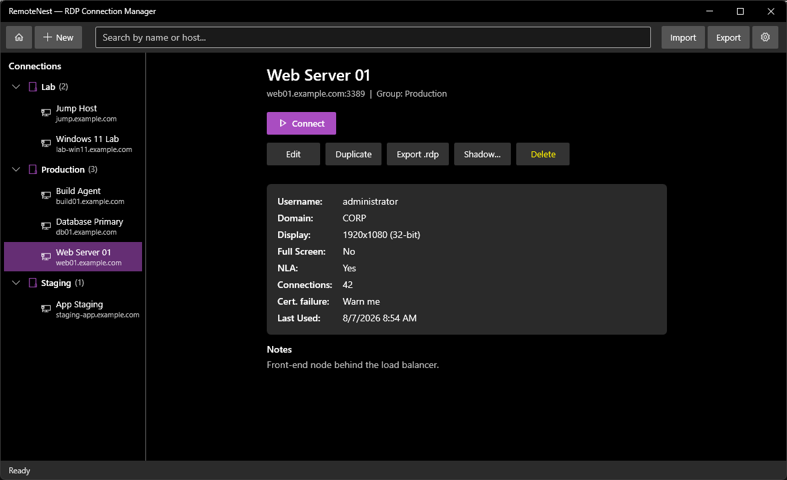
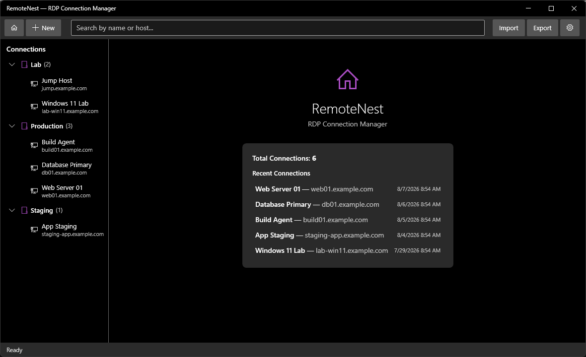
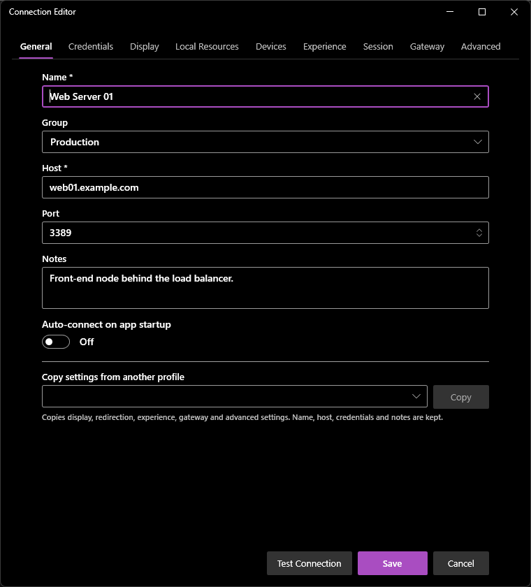
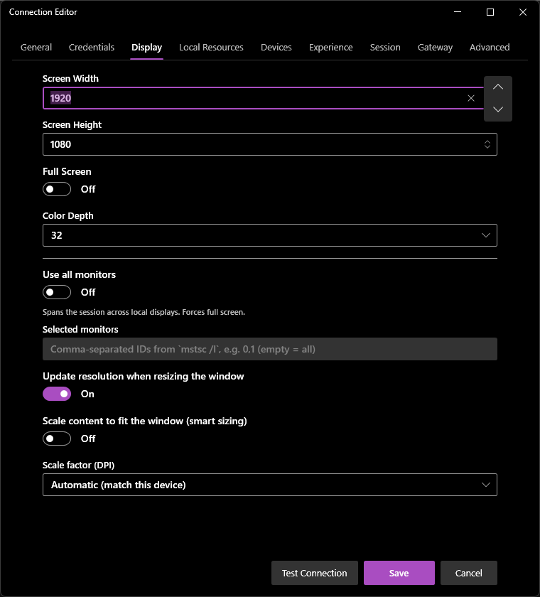
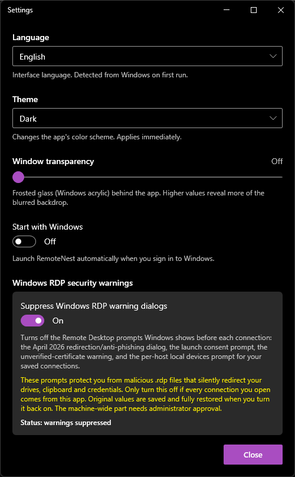

# RemoteNest

A Remote Desktop connection manager for Windows. Keep your RDP profiles in one place,
organized in groups, and launch them without retyping hosts and credentials.

*[Leia em português](README.pt-BR.md)*



## Features

- Connection profiles with groups, search, and duplication
- Around 65 `.rdp` settings per profile — display, redirection, gateway, experience,
  session, security and RemoteApp — plus a passthrough field for any key without
  dedicated UI
- Passwords encrypted with Windows DPAPI (tied to your user account, never in plain text)
- Import and export profiles as JSON, or import an existing `.rdp` file
- Session shadowing (`mstsc /shadow`)
- Optional switch that suppresses the Windows Remote Desktop warning dialogs, with an
  exact revert
- Light, dark, and dark blue themes, with adjustable Windows acrylic transparency
- English and Portuguese (Brazil), detected from Windows on first run

## Screenshots

The dashboard is the landing screen: totals and the connections you used most recently,
one click away.



The editor splits the settings across nine tabs, so nothing needs scrolling.

| General | Display |
| --- | --- |
|  |  |

Settings holds the language, theme, transparency, and the switch for the Windows RDP
warning dialogs.



## Download

Get the latest [release](https://github.com/xp3z41x/RemoteNest.Desktop/releases).

| File | What it is | Requires |
| --- | --- | --- |
| `RemoteNest-Setup.exe` | Installer. Adds Start menu entries and an uninstaller; installs per user or for all users. | [.NET Desktop Runtime 10 (x64)](https://dotnet.microsoft.com/download/dotnet/10.0/runtime) |
| `RemoteNest-Portable.exe` | Single file, nothing to install, runtime included. | Nothing |
| `RemoteNest-Portable-Slim.exe` | Single file, nothing to install, much smaller. | [.NET Desktop Runtime 10 (x64)](https://dotnet.microsoft.com/download/dotnet/10.0/runtime) |

Windows 10 1809 (build 17763) or newer, 64-bit.

Verify a download against `SHA256SUMS.txt` from the same release:

```powershell
Get-FileHash .\RemoteNest-Portable.exe -Algorithm SHA256
```

The binaries are not code-signed, so Windows SmartScreen may warn on first run and some
antivirus engines flag unsigned single-file .NET apps heuristically. Compare the hash
and, if you prefer, build from source.

## Build

Requires the [.NET 10 SDK](https://dotnet.microsoft.com/download/dotnet/10.0).

```powershell
dotnet build RemoteNest.sln -c Release
```

```powershell
dotnet test RemoteNest.sln -c Release
```

Building the release artifacts into `dist\` (the installer needs
[Inno Setup 6](https://jrsoftware.org/isinfo.php)):

```powershell
.\scripts\publish.ps1
```

## Data

Profiles live in a SQLite database at `%APPDATA%\RemoteNest\remotenest.db`, preferences
in `settings.json` beside it, and logs in `%LOCALAPPDATA%\RemoteNest\logs`. Removing the
app leaves those in place; delete the folders to remove your data.

Stored passwords are encrypted with DPAPI, so they can only be decrypted by the same
Windows user on the same machine. Copying the database elsewhere does not carry the
passwords with it.

## Windows RDP security warnings

Settings has a switch that turns off the Remote Desktop prompts Windows shows before a
connection: the redirection/anti-phishing dialog, the launch consent prompt, the
unverified certificate warning, and the per-host local devices prompt for your saved
hosts.

Those prompts exist to stop a malicious `.rdp` file from silently redirecting your
drives, clipboard and credentials, so only turn them off if every connection you open
comes from this app. The original registry values — including "this value did not
exist" — are saved before any change and restored exactly when you switch it back off.
The machine-wide part requires administrator approval.

## Tech

.NET 10, WPF with MVVM (CommunityToolkit.Mvvm), ModernWpfUI for the Fluent look, and
Microsoft.Data.Sqlite with hand-written SQL.

## License

Private project.
